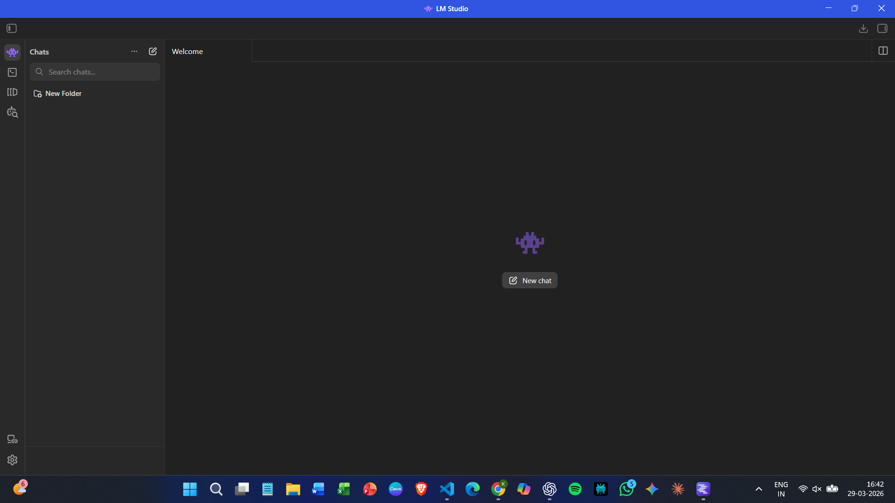
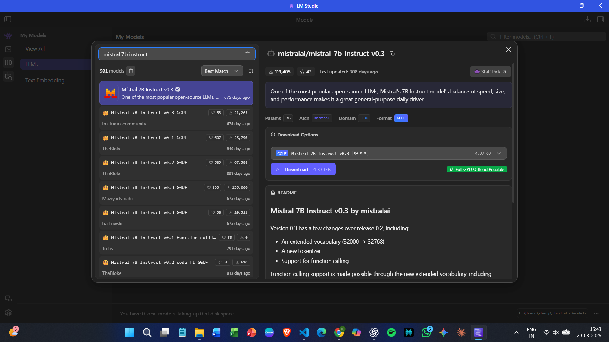
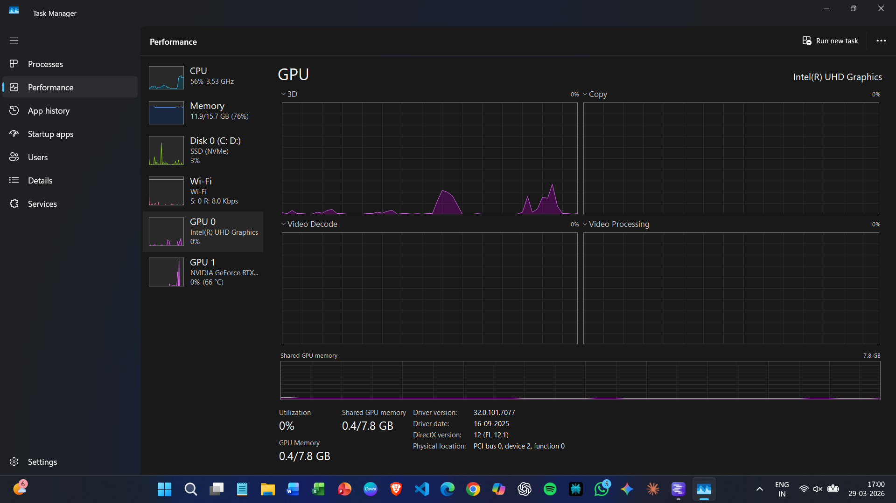

# Running AI Locally with LM Studio

## Introduction

To explore running AI models locally, I tested LM Studio, a desktop application that allows you to download and run large language models without using the command line.

The goal was to understand how easy it is to set up, how it performs on mid-range hardware, and whether it is practical for everyday use.

---

## Installation & First Impressions

LM Studio was downloaded from the official website and installed like a normal desktop application.

The setup process was straightforward and took only a few minutes.

On first launch:
- The interface was clean and minimal
- Navigation was intuitive
- No additional configuration was required

Overall, the onboarding experience felt smooth and beginner-friendly.

---

## Model Discovery & Selection

Using the built-in model browser, I searched for a lightweight model suitable for my system.

I selected:

- **Mistral 7B Instruct v0.3**
- Format: GGUF
- Quantization: Q4_K_M
- Size: ~4.37 GB

This model is commonly recommended for local use because it balances performance and resource usage.

---

## Model Download

The model was downloaded directly within LM Studio.

- Size: 4.37 GB  
- Network speed: ~300 Mbps  
- Download time: ~3–4 minutes  

Observations:
- Download was smooth with no interruptions
- Speed was consistent throughout
- No manual setup was required

---

## Model Loading

After downloading, the model was loaded into memory using LM Studio’s interface.

- Load time: a few seconds  
- No noticeable UI lag or freezing  

The process was simple and did not require any technical configuration.

---

## Running the Model

Once loaded, I tested the model using a few prompts:

- “Explain recursion simply”
- “Write a Python function for factorial”
- “Explain transformers in simple terms”

The responses were generated almost instantly.

- No noticeable delay after submitting prompts  
- Text streamed smoothly  
- No UI lag during interaction  

The experience felt surprisingly responsive for a local model.

---

## Performance Analysis

System performance was monitored using Task Manager during inference.

### GPU Usage

- GPU usage reached ~90–95% during response generation  
- Dropped back to idle after completion  

This indicates that GPU acceleration was actively used.

---

### CPU Usage

- CPU usage stayed around ~50–60%  
- Assisted with model execution alongside GPU  

---

### RAM Usage

- RAM usage reached ~75% (~12GB out of 16GB) after closing background apps  

Observations:
- Even a 7B quantized model consumes significant memory
- Closing other applications improved stability
- Available RAM matters more than total RAM in real usage

---

## Observations

- Setup was simple and required no technical knowledge  
- Model selection and download were seamless  
- GPU was actively used during inference  
- RAM usage was relatively high  
- System remained stable with no crashes  

---

## Overall Experience

The experience of running a local model using LM Studio was smoother than expected.

- Responses were fast  
- No UI lag was observed  
- The entire workflow felt beginner-friendly  

On a mid-range laptop (RTX 3050, 16GB RAM), running a 7B quantized model was not only possible but practical.

---

## Key Takeaways

- LM Studio is a strong entry point for local AI  
- Running local models is feasible on mid-range hardware  
- RAM is a key limiting factor  
- GPU acceleration significantly improves responsiveness  
- Quantized models make local inference accessible  

---

## Final Thoughts

LM Studio simplifies the process of running AI locally by removing most of the setup complexity.

For beginners or anyone looking to experiment with local models, it provides a smooth and accessible starting point.

While there are limitations in terms of hardware and model size, the overall experience demonstrates that local AI is already practical for everyday use.