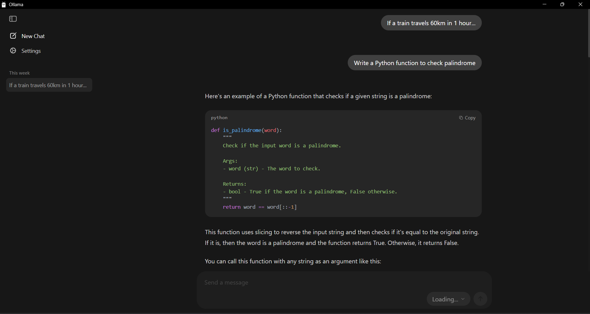
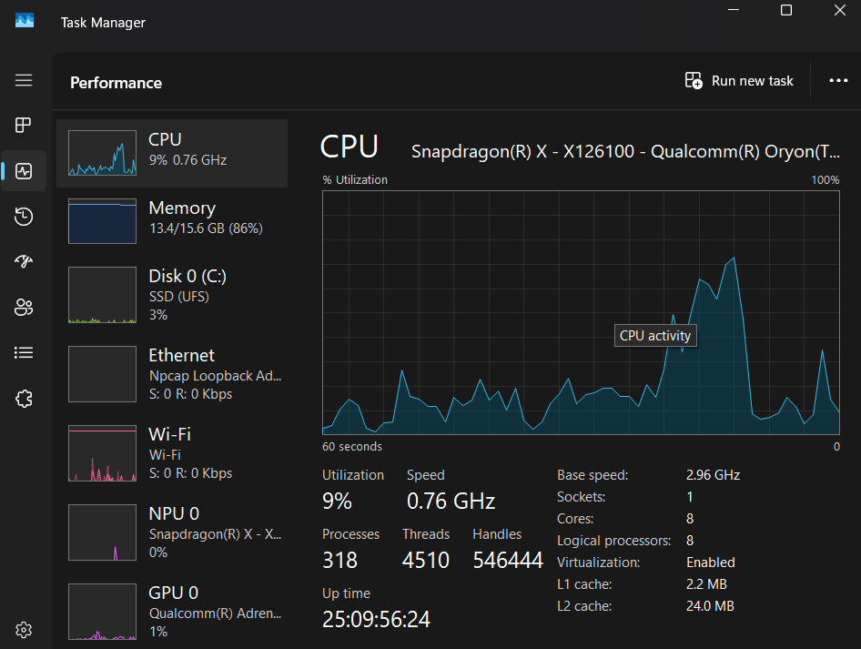
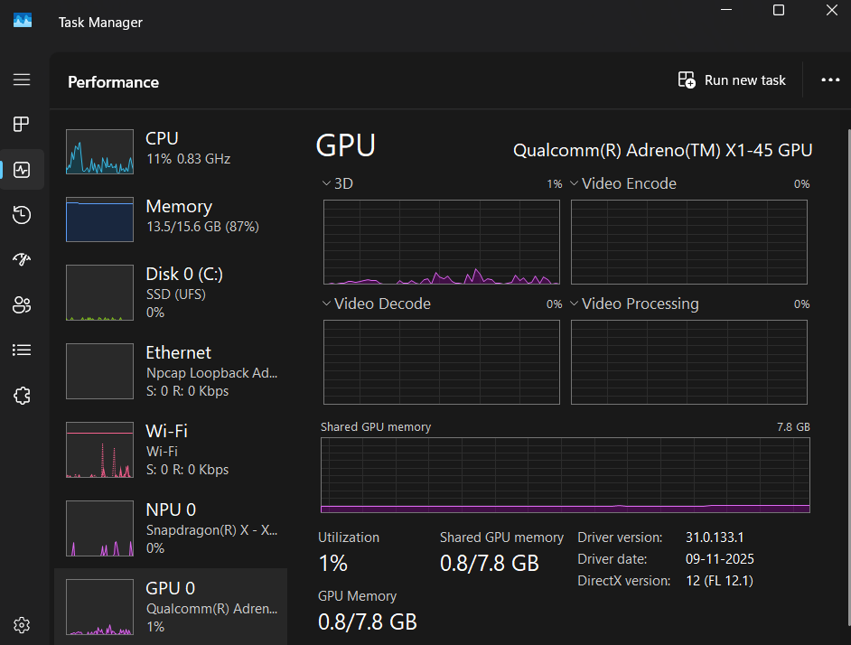
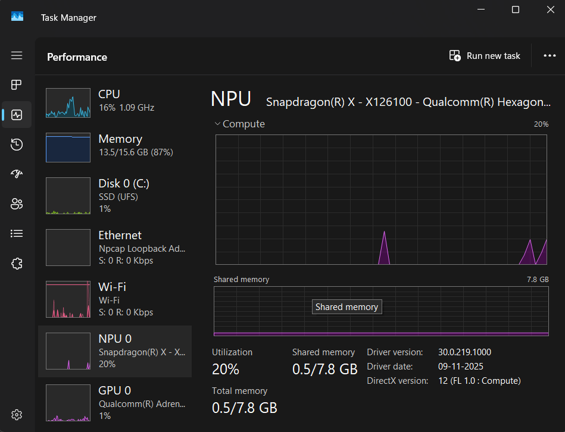
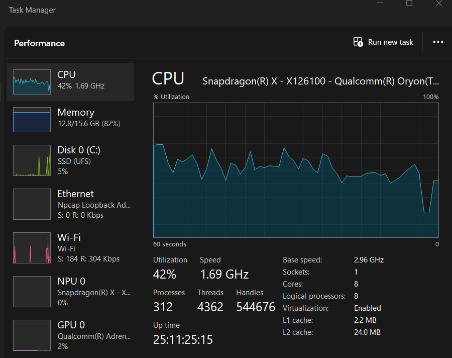
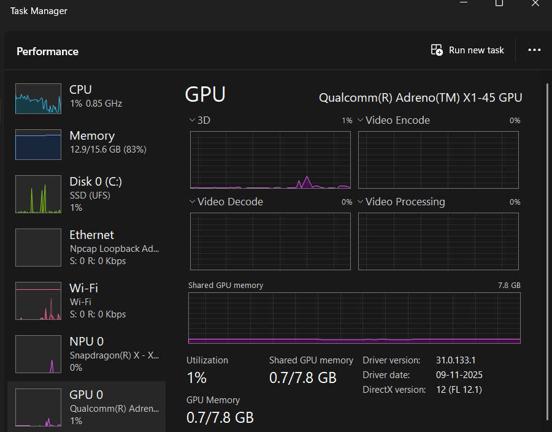
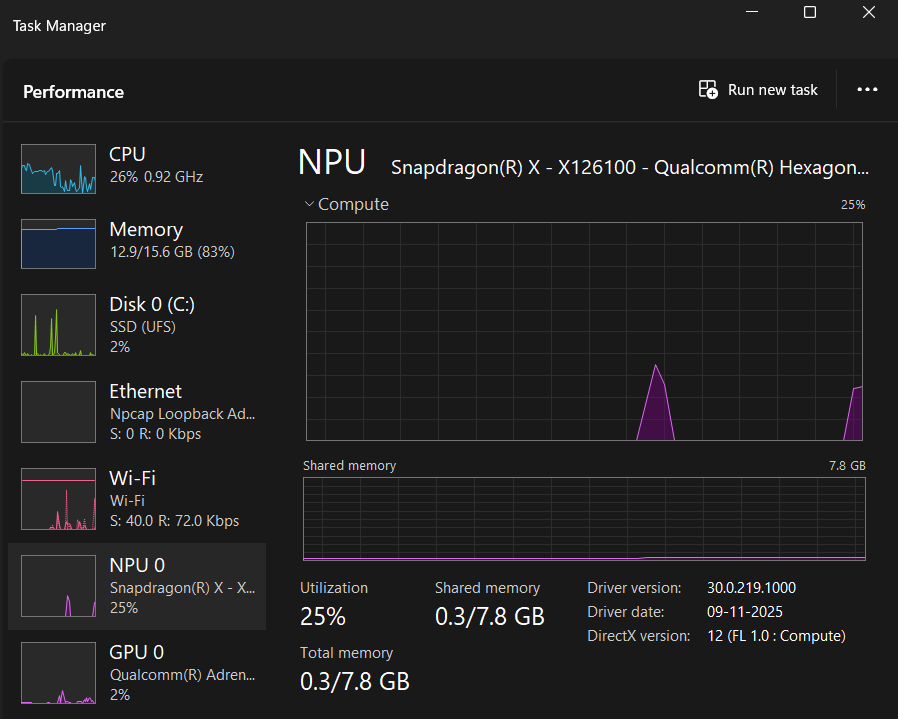

# Running AI Locally with Ollama (Phi vs Gemma3)

## Introduction

This experiment explores running large language models locally using Ollama, focusing on performance, resource usage, and behavior across different models.

Two models were tested:
- Phi (lightweight model)
- Gemma3 (larger, more capable model)

The goal was to understand:
- Differences in memory consumption
- CPU utilization
- Inference performance
- Practical trade-offs between model size and efficiency

---

## System Configuration

- CPU: (Your system CPU)
- RAM: 16 GB
- GPU: Not used (CPU-only inference)
- OS: Windows

 - Processor	Snapdragon(R) X - X126100 - Qualcomm(R) Oryon(TM) CPU (2.96 GHz)
 - Installed RAM	16.0 GB (15.6 GB usable)
 - System type	64-bit operating system, ARM-based processor
 - Edition	Windows 11 Home Single Language

---

## Tools Used

- Ollama (runtime environment)
- Python `psutil` (for monitoring RAM and CPU)

---

## Model Execution

Models were run using:
ollama run phi
ollama run gemma3

Both models were tested using similar prompts to maintain consistency.

---

## Monitoring Method

A Python script continuously tracked:
- RAM usage (MB)
- CPU usage (%)

This allowed real-time observation during both idle and active inference phases.

---

## Performance Analysis

# 🔹 Phi Model

### RAM Usage
- Peak usage: ~2200–2240 MB (~2.2 GB)

### CPU Usage
- Idle: ~0–1%
- Peak: ~350–390%

### Behavior
- Stable memory usage
- Moderate CPU spikes during inference
- Faster response generation compared to larger models

---

# 🔹 Gemma3 Model

### RAM Usage
- Peak usage: ~4060–4065 MB (~4.0 GB)

### CPU Usage
- Idle: ~0–1%
- Peak: ~350–400%

### Behavior
- Significantly higher memory usage
- CPU usage similar to Phi but sustained longer
- Slower response generation
- More stable output quality

---

## Comparative Analysis

| Metric        | Phi          | Gemma3       |
|---------------|--------------|--------------|
| Model Size    | Small        | Medium/Large |
| RAM Usage     | ~2.2 GB      | ~4.0 GB      |
| CPU Usage     | ~380% peak   | ~400% peak   |
| Speed         | Faster       | Slower       |
| Accuracy      | Moderate     | Higher       |
| Efficiency    | High         | Medium       |

---

## Key Observations

- **Memory scales with model size**  
  Gemma3 uses nearly double the RAM compared to Phi.

- **CPU usage remains similar across models**  
  Both models utilize multiple cores effectively.

- **Inference time increases with model size**  
  Larger models require more computation per token.

- **Model loading behavior**  
  Both models remain in memory after loading, enabling faster reuse.

---

## System Behavior Insights

From logs:

- CPU spikes (~350–400%) indicate multi-core utilization
- RAM remains consistently allocated during runtime
- Idle state shows minimal resource usage
- Inference phase is the primary bottleneck

---

## Limitations

- CPU-only inference limits performance
- No GPU acceleration available
- Ollama abstracts internal execution details
- Limited control over optimization parameters

---

## Ecosystem Analysis (Ollama)

### Strengths
- Very easy setup and usage
- Automatic model management
- Clean CLI interface
- Beginner-friendly

### Weaknesses
- Limited control over inference
- Slight overhead compared to low-level tools
- Less transparency in internal operations

---

## Overall Experience

Ollama provides a smooth and accessible way to run local LLMs, making it ideal for experimentation and learning.

Phi performed well for lightweight tasks with minimal resource usage, while Gemma3 demonstrated improved output quality at the cost of higher memory consumption and slower response times.

---

## Key Takeaways

- Smaller models are faster and more efficient
- Larger models provide better reasoning but require more resources
- CPU-based inference is functional but not optimal
- Ollama simplifies execution but limits deep optimization
- Model selection is critical based on use case

---

## Final Conclusion

Ollama is an effective entry point for local AI experimentation.

- **Phi** is suitable for fast, lightweight tasks
- **Gemma3** is better for more complex reasoning tasks

For performance-critical systems (like your project), transitioning to **llama.cpp** for optimized inference would be the next logical step.